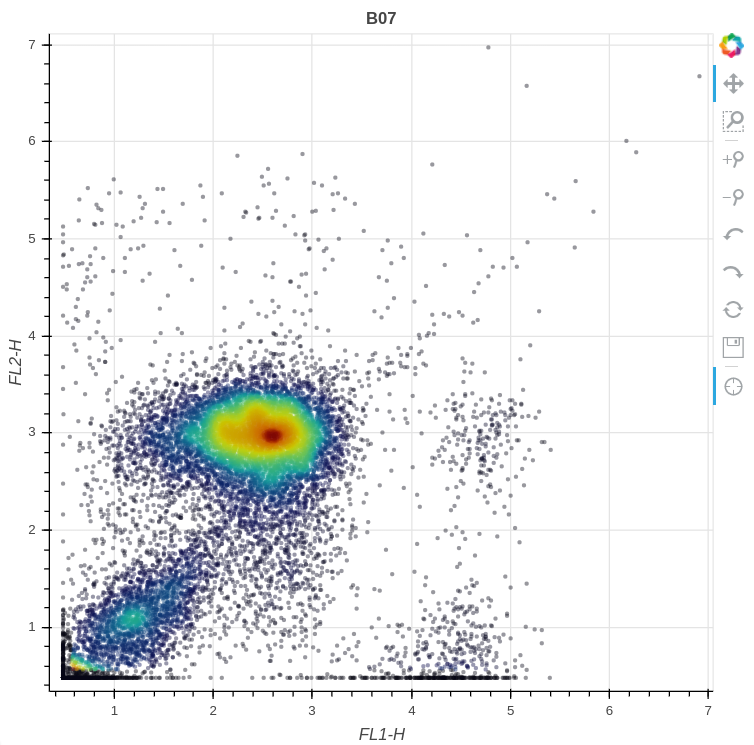

# 

[](https://pypi.python.org/pypi/flowkit/)
[](https://pypi.python.org/pypi/flowkit/)
[](https://travis-ci.com/whitews/FlowKit)

## Overview

FlowKit is an intuitive Python toolkit for flow cytometry analysis and visualization, including GatingML 2.0 support. Features include:

* Reading Flow Cytometry Standard data (FCS files), including FCS versions:
  * 2.0
  * 3.0
  * 3.1
* Exporting FCS data in any of the following formats:
  * A new FCS 3.1 file, with modified metadata and/or filtered events
  * NumPy array
  * Pandas DataFrame
  * CSV text file
* Compensating FCS events using spillover matrices in multiple formats:
  * As the $SPILL or $SPILLOVER keyword value format
  * FlowJo tab-delimited text format
  * NumPy array
  * GatingML 2.0 spectrumMatrix XML element
* Tranformation of original or compensated events in a variety of transforms used in the flow community:
  * Logicle
  * Inverse hyperbolic sine (arcsinh)
  * Hyperlog
  * Logarithmic
  * Channel ratios
  * Linear
* Optional, automatic filtering of negative scatter events and/or anomalous events
* Visualizing FCS event data:
  * Histogram of single channel data with a Gaussian kernel density estimate curve
  * Contour density plot of two channels
  * Interactive scatter plot of two channels
  * Interactive scatter plot matrix of any combination of channels



## Requirements

FlowKit supports Python version 3.6 or above. All dependencies are installable 
via pip, and are listed below.

***Note: FlowKit and FlowUtils use C extensions for significant performance 
improvements relating to various tranformations. If using `gcc`, version 5 or 
above is required for correct Logicle and Hyperlog transformations.***

Required Python dependencies:

* [flowio](https://github.com/whitews/flowio) >= 0.9.5
* [flowutils](https://github.com/whitews/flowutils) >= 0.7.1
* numpy >= 0.15
* scipy >= 1.0
* pandas >= 0.19
* matplotlib >= 3.0
* seaborn >= 0.9
* bokeh >= 1.0
* lxml >= 4.2
* anytree >= 2.4

## Installation

### From PyPI

`pip install flowkit`

### From source

```
git clone https://github.com/whitews/flowkit
cd flowkit
python setup.py install
```

## Usage

Click on the links below to a few Jupyter notebooks that demonstrate basic usage of the library. Note, the interactive scatterplots do not render on Github. Clone the repo (or download the example notebooks), and run them locally to see the fully interactive plots.

* [General Overview](https://github.com/whitews/FlowKit/blob/master/examples/flowkit-tutorial.ipynb)
* [Applying Transforms to a Sample](https://github.com/whitews/FlowKit/blob/master/examples/sample_transforms.ipynb)
