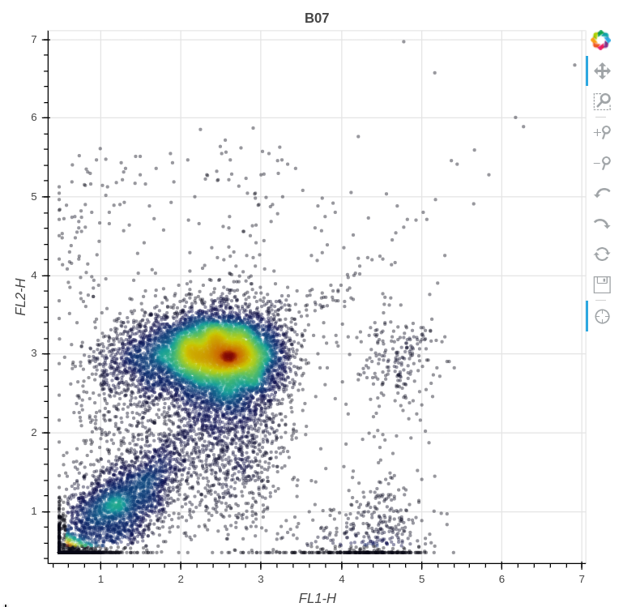

# 

[](https://pypi.python.org/pypi/flowkit/)
[](https://pypi.python.org/pypi/flowkit/)
[](https://pypi.python.org/pypi/flowkit/)

[](https://travis-ci.com/whitews/FlowKit)
[](https://codecov.io/gh/whitews/flowkit)
[](https://flowkit.readthedocs.io/en/latest/?badge=latest)

* [Overview](#overview)
* [Features](#features)
* [Requirements](#requirements)
* [Installation](#installation)
* [Usage](#usage)
* [Contributing](#contributing)

## Overview

FlowKit is an intuitive Python toolkit for flow cytometry analysis and visualization, with full support for the [GatingML 2.0 standard](http://flowcyt.sourceforge.net/gating/latest.pdf) and limited support for FlowJo 10 workspace files.

**Version 0.6 added experimental support for exporting FlowJo 10 workspace files from a Session. Support is currently limited to exporting data from a single sample group. Please [submit an issue](https://github.com/whitews/FlowKit/issues/new/choose) if you find any bugs related to this feature.**



## Features

* Read / Write FCS Files
  * Read FCS files, supporting FCS versions 2.0, 3.0, and 3.1
  * Export FCS data as:
    * A new FCS 3.1 file, with modified metadata and/or filtered events
    * NumPy array
    * Pandas DataFrame
    * CSV text file
* Compensation
  * Compensate events using spillover matrices from:
    * $SPILL or $SPILLOVER keyword value
    * FlowJo tab-delimited text
    * NumPy array
    * GatingML 2.0 spectrumMatrix XML element
  * Create a compensation matrix from a set of compensation bead files
* Transformation
  * Support for a variety of transformations used in the flow community:
    * Logicle
    * Inverse hyperbolic sine (ArcSinh)
    * FlowJo Bi-exponential
    * Hyperlog
    * Logarithmic
    * Channel ratios
    * Linear
* Gating
  * Full support for the GatingML 2.0 specification
    * Import GatingML XML documents as gating strategies
    * Export gating strategies as a valid GatingML XML document
  * Limited support for importing FlowJo 10 workspace files. Workspace files are currently limited to the following features:
    * Linear, logarithmic, bi-exponential, and logicle transforms
    * Polygon, rectangle, ellipse, and quadrant gates
  * Programmatically create gating strategies including polygon, rectangle, range, ellipsoid, quadrant, and boolean gates
  * Easily retrieve gating results from a gating strategy as a Pandas DataFrame. Results include:
    * FCS sample ID
    * Gate name
    * Parent gate
    * Gate path
    * Gate level (position in gate hierarchy tree)  
    * Absolute event count
    * Relative percentage
    * Absolute percentage
* Visualization
  * Histogram of single channel data
  * Contour density plot of two channels
  * Interactive scatter plot of two channels
  * Interactive scatter plot matrix of any combination of channels
  * Interactive scatter plots of gates with sample events

## Requirements

FlowKit supports Python version 3.6 or above. All dependencies are installable 
via pip, and are listed below.

***Note: FlowKit and FlowUtils use C extensions for significant performance 
improvements. If using `gcc`, version 5 or 
above is required for correct Logicle and Hyperlog transformations.***

Required Python dependencies:

* [flowio](https://github.com/whitews/flowio) == 0.9.11
* [flowutils](https://github.com/whitews/flowutils) == 0.9.4
* numpy >= 1.19
* scipy >= 1.3
* statsmodels
* pandas >= 1.1
* matplotlib >= 3.1
* seaborn >= 0.11
* bokeh >= 1.4
* lxml >= 4.4
* anytree >= 2.6

## Installation

### From PyPI

```
pip install flowkit
```

### From source

```
git clone https://github.com/whitews/flowkit
cd flowkit

python setup.py install
```

## Usage

Below are a few Jupyter notebooks demonstrating basic usage of the library. Note, the interactive scatterplots do not render on GitHub. Clone the repo (or download the example notebooks), and run them locally to see the fully interactive plots.

* [General Overview](https://github.com/whitews/FlowKit/blob/master/examples/flowkit-tutorial.ipynb)
* [Applying transforms to a Sample](https://github.com/whitews/FlowKit/blob/master/examples/sample_transforms.ipynb)
* [Compensating events using spillover matrix](https://github.com/whitews/FlowKit/blob/master/examples/sample_compensation.ipynb)
* [Importing a FlowJo 10 WSP file & replicating analysis in FlowKit](https://github.com/whitews/FlowKit/blob/master/examples/flowkit-session-replicate-flowjo-wsp.ipynb)
* [Compare mean fluorescence intensity (MFI) in gated populations](https://github.com/whitews/FlowKit/blob/master/examples/flowkit-session-compare-mfi-of-gated-events.ipynb)
* [Dimension reduction on gated populations](https://github.com/whitews/FlowKit/blob/master/examples/dimension_reduction_on_gated_populations.ipynb)
* [Comparison between Leiden & Louvain clustering](https://github.com/whitews/FlowKit/blob/master/examples/clustering_comparison_leiden_vs_louvain.ipynb)

## Contributing

Want to get involved in the development of FlowKit? 

[Read our CONTRIBUTING guidelines](https://github.com/whitews/FlowKit/blob/master/CONTRIBUTING.md)
